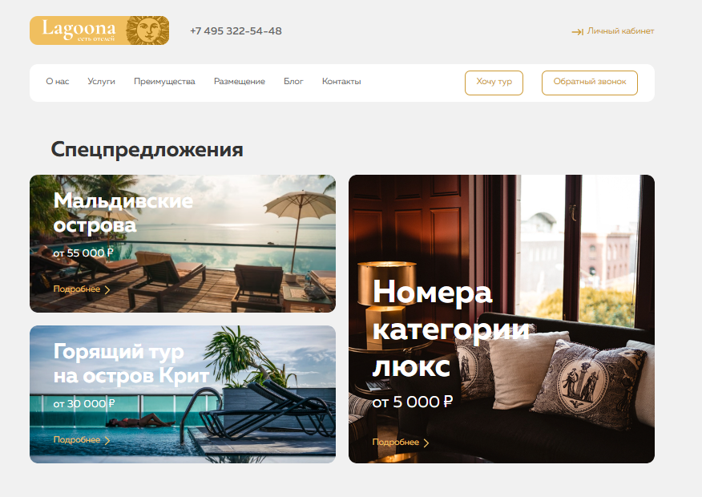
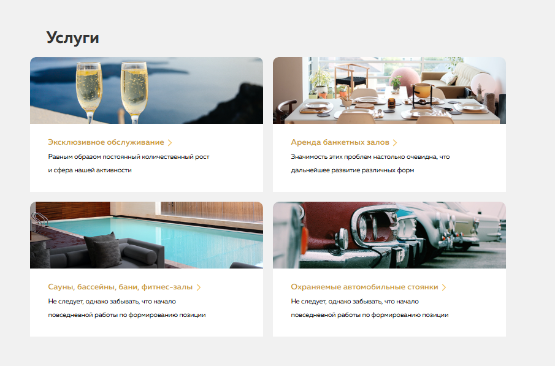
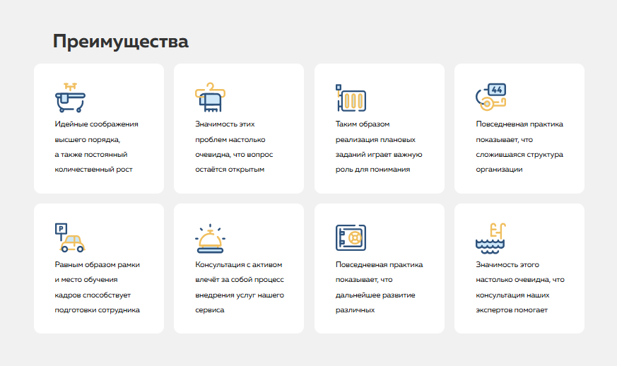
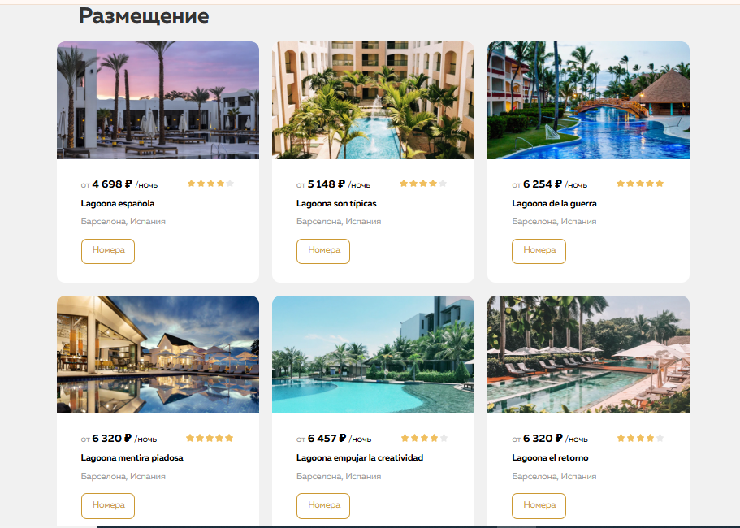
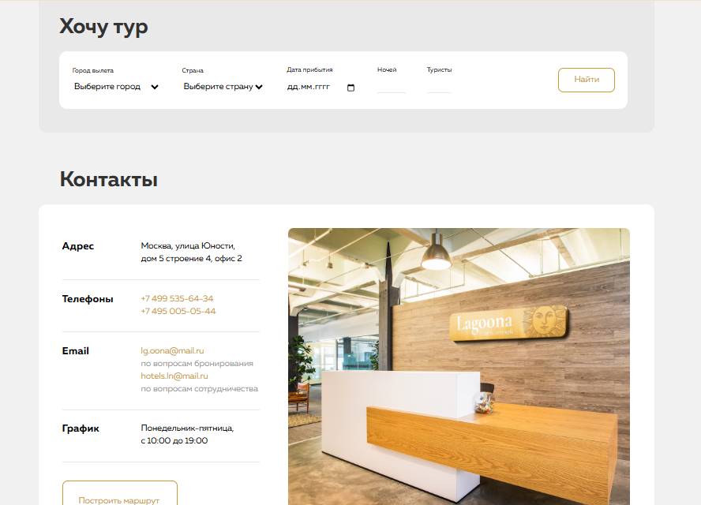

# Lagoona — HTML & CSS learning project

Short: a learning landing page for the Lagoona hotel chain, built with HTML and CSS.

**What's included**

- **Files:** [index.html](index.html), [css/style.css](css/style.css),[LICENSE](LICENSE)

**Topics and techniques covered**

- **HTML:** semantic elements (`header`, `nav`, `main`, `section`, `article`, `footer`, `address`, `form`), navigation structure, visually-hidden headings via the `visually-hidden` class for accessibility, forms with `select`, `input[type=date]`, `input[type=number]`, and usage of `mailto`/`tel` links.
- **CSS:** reset/normalize (`css/normalize.css`), `box-sizing`, custom fonts with `@font-face`, Flexbox for layout and alignment, background images with `background-size`, button and form styling, a responsive container (`.container`), utility classes (`.flex`, `.reset-list`, `.visually-hidden`).
- **Graphics & media:** inline SVG icons, background images, responsive images (`max-width: 100%`).
- **Accessibility:** semantic markup and hidden headings to support screen readers.

**Screenshots**

Below are screenshots from the `screenshots` folder included inline for convenience.

- **Header**

  

- **Services**

  

- **Advantages**

  

- **Hotels**

  

- **Contacts**

  

**How to view the project locally**

1. Clone or copy the repository.
2. Open `index.html` in your browser.
